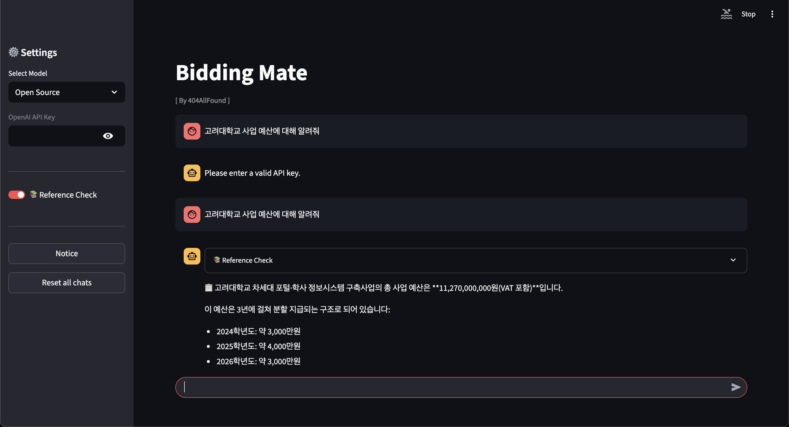

# 발표 자료
- [RFP 분석을 위한 RAG 기반 정보 추출 시스템]https://drive.google.com/file/d/16zEA8xrlwJu33fQ7QpyYIQ4PojXhSX0L/view?usp=sharing

# 4팀 협업일지
- 윤승호
    LINK: [https://www.notion.so/yoonsnowdev/1d6219b29fc380a0b152d5457e2f4839?pvs=4](https://www.notion.so/1d6219b29fc380a0b152d5457e2f4839?pvs=21)
- 김민경
    LINK: [https://endurable-ice-f3c.notion.site/Daily-237218930d5e80d0b795dbfe1b9637b8](https://www.notion.so/237218930d5e80d0b795dbfe1b9637b8?pvs=21)
- 방지형
    LINK: [https://www.notion.so/1fbf89eac2f1805e8b09e102fc1a73a9?source=copy_link](https://www.notion.so/1fbf89eac2f1805e8b09e102fc1a73a9?pvs=21)
- 손주희
    LINK: [https://www.notion.so/23846e2fcad880189b0ad50df0aea229?source=copy_link](https://www.notion.so/23846e2fcad880189b0ad50df0aea229?pvs=21)
- 신한호
    LINK: [https://www.notion.so/_4-_-237c6f869cf680c28105e0b9018cfa6f?source=copy_link](https://www.notion.so/237c6f869cf680c28105e0b9018cfa6f?pvs=21)
- 이승종
    LINK: [https://www.notion.so/237e3ffbb65580fa9e19debd13719714?source=copy_link](https://www.notion.so/237e3ffbb65580fa9e19debd13719714?pvs=21)

# RFP 기반 RAG 시스템 프로젝트

## 사용해보기
아래 주소에서 직접 사용 가능합니다.
➡ **[Bidding Mate 웹 데모](http://34.68.253.209:8501/)**

### 사용 방법
1. **모델 선택**
	- 사이드바에서 `Open Source` 또는 `OpenAI` 모델 중 선택
2. **OpenAI 모델 사용 시**
	- 유효한 OpenAI API 키를 입력
3. **질문 입력**
	- 채팅창에 분석하고 싶은 RFP 관련 질문 입력
4. **Reference Check 옵션**
	- 근거 문서 확인이 필요하면 Reference Check 활성화

### 예시 사진



---

## 1. 프로젝트 개요
이 프로젝트는 자연어 처리(NLP) 및 대규모 언어모델(LLM) 지식을 바탕으로 
기업 및 정부의 복잡한 형태의 제안요청서(RFP)를 효과적으로 분석·추출·요약하여  
B2G 입찰지원 전문 컨설팅 스타트업 '입찰메이트'의 서비스 품질을 향상시키는 것을 목표로 합니다.

---

## 2. 프로젝트 배경
- **도메인 특성**: RFP는 수십~수백 페이지에 달하며, 표·이미지·텍스트가 혼합된 형태
- **비즈니스 니즈**:
	- 하루 수백 건의 공공 입찰 공고 중 고객사 맞춤형 기회를 빠르게 탐색
	- 주요 요구 조건, 대상 기관, 예산, 제출 방식 등 핵심 정보 파악
- **목표**:
	- 사용자의 질의에 기반하여 RFP에서 관련 정보를 신속·정확하게 검색
	- 필요한 경우 RFP 내용을 요약하여 제공
	- 사내에서 재사용 가능한 RAG 시스템 구현
	
---

## 3. 데이터 구성
- **문서**: 실제 RFP 문서 100건
- **형태**:
	- PDF 원문 + 추출된 메타데이터
	- 표, 이미지, 본문 텍스트 포함
- **메타데이터 일부**:
	- 사업명
	- 예산
	- 발주처
	- 제출 기한
	- 입찰 방식
	
--- 

## 4. 시스템 목표
1. **RFP 문서 분석**
	- OCR 시도(보류): 문서 내 이미지/스캔 영역에 대해 OCR을 시도했으나 최종 적용은 제외
	- 표 데이터화: 표(Table)만 데이터화하여 구조화 작업에 활용
	- 결과물 형태: 전처리 결과는 **구조화된 JSON**으로 저장/사용
2. **Q&A 기능 구현**
	- 사용자 질의 -> 관련 문서 검색(Retriever) -> LLM 기반 답변 생성(Generator)
3. **요약 서비스**
	- 장문 RFP를 요약하여 중요한 항목만 빠르게 확인 가능
4. **성능 평가**
	- Retriever 및 Generator 각각의 성능 측정
	- Faithfulness, Correctness 등 지표 기반 평가
	
---

## 5. 사용 기술
- **전처리**: pyautogui, pyperclip, pytesseract, pdf2image (OCR 시도, 최종 제외)
- **임베딩 모델**: KoSimCSE, KR-SBERT, 기타 한국어 SBERT 계열
- **DB/인덱스**: FAISS (**LangChain FAISS** 사용)
- **LLM**: Hugging Face Transformers(Midm-Base), OpenAI API
- **프레임워크**: LangChain, LangGraph
- **평가**: LangSmith, LLM-as-a-judge 방식
- **프론트엔드**: Streamlit
- **백엔드/API**: FastAPI

---

## 6. 실험 및 평가 계획
1. **Retriever 실험**
	- 다양한 임베딩 모델 비교
	- LangChain FAISS 기반 Dense Retrieval 사용 (BM25/Hybrid는 추후 실험 항목으로 보류)
	- top-k 및 chunk size 최적화
2. **Generator 실험**
	- HuggingFace 기반 LLM vs OpenAI GPT 모델
	- 프롬프트 최적화 및 근거 인용률 측정
3. **평가 지표**
	- Faithfulness / Correctness (5점 척도)
	- 응답 근거 포함 여부
4. **보고서/발표**
	- 실험 과정, 의사결정, 평가 결과를 보고서와 발표 자료로 제출
	
---
	
## 7. 기대 효과
- **업무 효율 향상**: RFP 분석·검색·요약 자동화
- **고객 만족도 개선**: 맞춤형 입찰 기회 제공
- **사내 기술 자산 확보**: RAG 시스템 운영 경험 및 평가 데이터 축적

---

## 8.프로젝트 산출물

```text
📂 프로젝트 루트
├── 📂 data                # 데이터 저장소 (평가 데이터)
│
├── 📂 notebook            # EDA 및 분석용 Jupyter Notebook
│   └── EDA.ipynb
│
├── 📂 scripts             # 전처리 및 평가 스크립트 모음
│   ├── AB_pipeline_eval.py             # A/B 평가 문서 작성 코드 (LangSmith 기반 성능 평가)
│   ├── hwp_to_pdf.py                   # HWP → PDF 변환 스크립트
│   └── preprocess.py                   # 문서 전처리 및 JSON 생성
│
├── 📂 src                 # RAG 시스템 핵심 모듈
│   ├── A_embedding.py                 # 임베딩 생성
│   ├── A_indexing.py                  # 벡터 인덱스 생성
│   ├── A_retriever.py                 # Retriever (검색기) 모듈
│   ├── A_generation.py                # Generator (생성기) 모듈
│   ├── B_retriever.py                 # Retriever (B 버전)
│   ├── B_generation.py                # Generator (B 버전)
│   ├── backend.py                     # 백엔드 API
│   ├── frontend.py                    # 프론트엔드 실행 스크립트
│   ├── AB_pipeline_eval.py             # A/B 파이프라인 통합 평가 코드 (Retrieval + Generation)
│
├── main.py                # 프로젝트 실행 진입점
├── README.md              # 프로젝트 개요 및 실행 가이드
└── .gitignore             # Git 제외 규칙
```

## 9. 주요 기능

| 구분          | 설명 |
|---------------|------|
| **전처리**    | PDF/HWP → 텍스트 변환, 청크 분할, 메타데이터 부착 |
| **임베딩**    | SBERT, KoSimCSE 등 다양한 한국어 임베딩 모델 지원 |
| **인덱싱**    | FAISS 기반 벡터 검색 인덱스 생성 |
| **검색**      | Dense, Sparse, Hybrid 검색 방식 지원 |
| **생성**      | OpenAI, HuggingFace 기반 LLM 응답 생성 |
| **평가**      | LangSmith, Cosine Similarity 기반 성능 평가 |
| **A/B 비교**  | Retriever/Generator 구조별 성능 비교 분석 |

---
## 10. 평가 방식 (LangSmith)

RAG 시스템의 **Retriever**와 **Generator** 성능을 LangSmith에서 자동 평가합니다.

### 10.1 데이터 구조

`langsmith_eval_A.jsonl` 예시:

```json
{
  "inputs":  { 
    "input": "스마트캠퍼스 기능은?",
    "context": "컨텍스트 문서1 || 컨텍스트 문서2"
  },
  "outputs": {
    "output": "스마트캠퍼스는 ..."
  },
  "retrieved_ids": ["doc1:1:intro", "doc2:3:table"],
  "pipeline": "A"
}
```

- `inputs.input` : 질문  
- `inputs.context` : 검색된 문서(컨텍스트)  
- `outputs.output` : 모델 생성 응답  
- `retrieved_ids` : 검색된 문서 ID  
- `pipeline` : 파이프라인 구분값

### 10.2 LangSmith UI에서 평가 실행

1. **Datasets → New Dataset** 에서 `langsmith_eval_A.jsonl` 업로드  
   - 필드 매핑은 자동으로 `inputs` / `outputs` 로 인식됨
2. 상단 **Evaluate → New Evaluation** 클릭  
3. **Choose Target** 단계에서 **No target function** 및 **Use dataset outputs** 옵션 선택  
4. **Evaluator** 추가 (아래 프롬프트/스키마 사용)  
5. 평가 실행 → 결과 테이블에서 **score(0–5)** + **rationale(근거)** 확인

### 10.3 평가 축
RAG 시스템 평가는 두 축으로 분리합니다
1) **검색 컨텍스트 적합성 (Retrieval Quality)**  
2) **생성 정확성/충실성 (Generation Faithfulness)**

### 10.3.1 검색 컨텍스트 적합성 평가 프롬프트

```text
You are an expert data labeler evaluating RETRIEVAL QUALITY for a RAG system.
Score the context for how well it supports answering the input question.

<Rubric (5-point scale)>
5: Context is directly relevant and sufficient to answer all parts of the question with high confidence.
4: Mostly relevant and sufficient; minor gaps but still clearly answers the question.
3: Partially relevant; covers some aspects but notable gaps/irrelevant portions.
2: Mostly irrelevant or insufficient; significant gaps to answer the question.
1: Irrelevant or misleading context; unusable for answering the question.
0: Empty or unusable content.

<Instructions>
- Read the input question and the provided context.
- Judge ONLY the context (not the model output).
- Consider directness, completeness, and lack of noise/irrelevance.
- Return a JSON object with: 
  {
    "score": <0-5 integer>,
    "rationale": "<why this score>",
    "citations": ["<exact phrases from context that justify the score>", ...]
  }
- The rationale MUST explicitly reference the cited phrases.
- If score ≤ 3, include at least 2 citations when possible.

<Input>
{{inputs.input}}
</Input>

<Context>
{{inputs.context}}
</Context>
```

**Feedback configuration (JSON Schema)**

```json
{
  "title": "retrieval_quality",
  "description": "Score how well the retrieved context supports answering the input question.",
  "type": "object",
  "properties": {
    "score": {
      "title": "score",
      "type": "integer",
      "minimum": 0,
      "maximum": 5
    },
    "rationale": {
      "title": "rationale",
      "type": "string",
      "minLength": 1
    },
    "citations": {
      "title": "citations",
      "type": "array",
      "items": {
        "type": "string"
      }
    }
  },
  "required": [
    "score",
    "rationale"
  ],
  "additionalProperties": false
}
```

### 10.3.2 생성 정확성/충실성 평가 프롬프트

```text
You are an expert data labeler evaluating GENERATION FAITHFULNESS and CORRECTNESS in a RAG system.
Use ONLY the provided context to verify the model output. Penalize any statements not supported by the context.

<Rubric (0–5)>
5: Fully correct & faithful to context; answers all parts; no unsupported claims.
4: Correct with minor omissions/ambiguities; no major unsupported claims.
3: Partially correct; some omissions or mildly unsupported claims.
2: Mostly incorrect/unfaithful; multiple unsupported/contradictory claims.
1: Incorrect/misleading; largely unsupported by context.
0: Empty/off-topic.

<Strict rules>
- Grounding: Every factual claim MUST be supported by the context. If the context is silent, the correct behavior is to say so (rewarded). Unsupported guesses are penalized.
- Normalization: Numbers/dates/units must match the context. Light arithmetic using only context is allowed; otherwise penalize.
- Contradictions: Any statement that conflicts with the context forces the score ≤ 2.
- Hallucination cap: If any non-trivial hallucination exists, cap the score at 3.
- Multi-part questions: Check coverage of each sub-question; missing parts lower the score.

<What to return>
Return a JSON object with these fields:
{
  "score": <0-5 integer>,
  "rationale": "<why this score; must include verbatim quotes from context>",
  "claims": [
    {"claim":"<atomic claim from output>","status":"supported|unsupported|contradicted|partial","evidence":["<context quote>", "..."]}
  ],
  "corrected_answer": "<best possible answer strictly from context; if insufficient, say '문서에 정보 없음' and explain briefly>",
  "missing_info": ["<which needed facts are absent from context>", "..."]
}

<Input>
{{inputs.input}}
</Input>

<Context>
{{inputs.context}}
</Context>

<Output>
{{outputs.output}}
</Output>

<Process>
1) Extract atomic claims from <Output>.
2) For each claim, find exact supporting/conflicting snippets in <Context> (quote verbatim).
3) Decide status per claim and compute overall score per rubric.
4) Compose a concise "corrected_answer" using ONLY <Context>. If info is missing, state "문서에 정보 없음" and list what's missing.
5) Write a short rationale that cites key quotes and justifies the score.
```

**Feedback configuration (JSON Schema)**

```json
{
  "title": "gen_faithfulness_correctness",
  "description": "Scores generation faithfulness/correctness against provided context; includes claim-level analysis and a corrected, grounded answer.",
  "type": "object",
  "properties": {
    "score": {
      "title": "score",
      "type": "integer",
      "minimum": 0,
      "maximum": 5
    },
    "rationale": {
      "title": "rationale",
      "type": "string",
      "minLength": 1
    },
    "claims": {
      "title": "claims",
      "type": "array",
      "items": {
        "type": "object",
        "properties": {
          "claim": { "type": "string" },
          "status": { "type": "string", "enum": ["supported", "unsupported", "contradicted", "partial"] },
          "evidence": {
            "type": "array",
            "items": { "type": "string" }
          }
        },
        "required": ["claim", "status"]
      }
    },
    "corrected_answer": {
      "title": "corrected_answer",
      "type": "string"
    },
    "missing_info": {
      "title": "missing_info",
      "type": "array",
      "items": { "type": "string" }
    }
  },
  "required": ["score", "rationale", "corrected_answer"],
  "additionalProperties": false
}
```